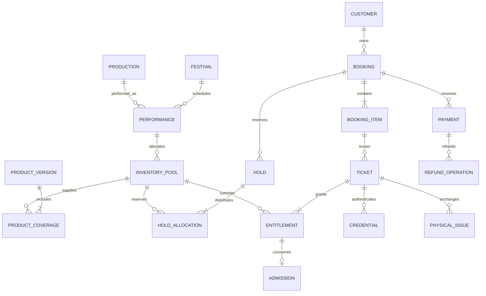

# Database implementation plan

## Authority and conventions

Use one transactional PostgreSQL database for the MVP, with schemas ready for future festivals. PostgreSQL is the authority for capacity, payment identity, entitlements, credential activation and admission. SQS, caches, PDFs and client receipts cannot independently establish stock or entry rights.

The current implementation uses PostgreSQL through node-postgres/Drizzle and reviewed SQL migrations. The PRD's RDS PostgreSQL Multi AZ and Prisma choices remain deployment alternatives. Use immutable UUID primary keys, separate public references, `timestamptz` stored in UTC and Asia/Kolkata display at the application boundary. Store money in integer paise, with explicit INR currency. Quantities must be positive integers; counters may be zero. Use checked integer/bigint types with safe API serialization, never floating-point money.

The tables and migration batches below are proposed designs based on INV01–04 and the PRD data dictionary. Exact column names and enum values will be finalized in schema review. Do not seed illustrative venue capacities as approved production data.

## Entity groups

| Tables | Key fields and relationships |
| --- | --- |
| `venues`, `zones`, `zone_rows` | Venue address, physical level/subzone, internal row labels and surveyed row capacities |
| `capacity_revisions`, `performance_zone_capacities` | Evidence, approver, safe ceiling, safety/accessibility blocks, revision and per-show zone authority |
| `festivals`, `policy_versions` | Venue, dates, branding, contacts, terms, exchange policy and approved configurable defaults |
| `productions`, `performances` | Play/troupe metadata; festival, stage, times, setup/clearing buffers, entry windows and publication/cancellation status |
| `categories`, `mapping_versions`, `mapping_ranges` | Premier/Superior/Balcony sale allocation, physical row intervals, version and approval |
| `products`, `product_versions`, `product_coverage` | Daily/Season type, sale window, price, optional cap; explicit performance, pool and refund weight per version |
| `inventory_pools` | Performance, physical zone/subzone, category, mapping reference, allocation, held, committed and optimistic version |
| `customers`, `customer_contacts` | Customer identity and normalized, verified mobile/email ownership |
| `otp_challenges`, `sessions` | Purpose/destination digest, keyed OTP hash, expiry, attempts; hashed session identity and revocation |
| `staff_users`, `role_assignments`, `gates`, `devices`, `staff_scopes` | Individual roles/MFA references, festival/show/gate permissions and device revocation |
| `bookings`, `booking_items`, `holds`, `hold_allocations` | Customer, lifecycle, expiry, item quantities, immutable quote/terms and per-pool reservation |
| `payment_attempts`, `payments` | External-call attempt and uncertainty separately from unique captured/authorized provider payment records |
| `tickets`, `entitlements` | One ticket per item ordinal; one right per ticket/performance referencing the committed pool |
| `credentials`, `physical_issues` | Token hash, encrypted material where required, digital/physical type and state; preparation, serial, proof reference and handover |
| `scan_requests`, `admissions`, `incidents` | Scoped request digest/result, unique entry, show/gate/device/actor/time and supervised exception history |
| `refund_operations`, `refund_items` | Unique operation, payment, selected rights, reserved amount, provider refund ID, state and reason |
| `inventory_movements`, `inventory_adjustments` | Immutable stock deltas, operation/source, reason, actor, preview versions and committed outcome |
| `webhook_events`, `outbox_events`, `job_executions` | Provider deduplication, protected payload/digest, processing state, delivery attempts and consumer deduplication |
| `idempotency_records`, `audit_events` | Authenticated scope/key/input digest/result; redacted actor/action/before-after/device/outcome |
| `reconciliation_cases`, `deletion_ledger`, `legal_holds` | Assigned discrepancies, resolution history, privacy deletion replay and retention exceptions |

Separating `payments` from `payment_attempts` permits multiple captured payments for one booking to be represented and refunded without losing provider identity. It refines the PRD's conceptual dictionary rather than changing its payment rules.

## Relationship outline

Each ticket remains stable through printing, credential replacement and cancellation. A Season product expands into explicit entitlements. No date-based reset or separate physical-ticket admission database is allowed.

## Required constraints

| Invariant | Enforcement plan |
| --- | --- |
| No negative stock | Pool checks: `allocation >= 0`, `held >= 0`, `committed >= 0`, `held + committed <= allocation` |
| Physical ceiling respected | Lock the per-performance zone-capacity authority before allocation changes; validate sum of category allocations plus reserve against approved ceiling |
| No incompatible row overlap | Validate row ranges and mapping assignments under the same authority lock; use PostgreSQL exclusion constraints where the chosen representation permits |
| Unique pool | Unique performance/physical-zone/category dimensions; sold mapping revisions cannot create parallel stock for the same physical units |
| Stable sold coverage | Unique product-version/performance; prohibit modification after use in a sold item; store purchase snapshots |
| Single verified contact owner | Partial unique index on contact type/normalized value for verified bindings |
| One allocation per hold/pool | Unique `(hold_id, pool_id)` and positive quantity |
| No duplicate payment identity | Unique provider/order identity on order attempts and provider/payment identity on payment records |
| One ticket per person | Unique `(booking_item_id, ordinal)` and ordinal/quantity validation in fulfillment |
| One right per performance | Unique `(ticket_id, performance_id)`; entitlement pool must belong to that performance |
| One active credential | Unique token hash and partial unique index on `ticket_id` for active credentials |
| One physical preparation/serial | Unique preparation reference and serial; permit at most one open preparation per ticket through a partial index/state guard |
| One standard admission | Unique `(ticket_id, performance_id)` plus a composite foreign key to the entitlement |
| Durable request replay | Unique admission request UUID; scoped input digest/result in `scan_requests` for both success and denial |
| Safe refunds | Unique operation ID and provider refund ID; locked payment amount accounting limits pending plus successful refunds to captured amount |
| Durable event deduplication | Unique provider/event ID and immutable operation keys for inventory movements |
| Safe request retry | Unique authenticated scope/key; matching digest required; permanent financial/admission constraints survive cache expiry |

Cross-row sums and relationships require locked transactions, composite foreign keys or reviewed triggers; ordinary row `CHECK` constraints cannot enforce aggregate capacity. Partial indexes, exclusion constraints and any triggers belong in reviewed SQL migrations when Prisma cannot represent them.

Do not enforce one payment per booking: a duplicate capture must be recorded. Do not use `(ticket_id, calendar_date)` for admission: two performances on one date need separate rights. Do not derive product caps solely from a sale-window version; a shared cap authority must prevent overselling across versions when the approved cap applies to the whole product.

## Locking and transaction protocol

Proposed global order when an operation touches these records: booking, hold, payment/refund accounting, product-cap authority, capacity authority, pools sorted by ID, tickets sorted by ID, entitlements sorted by ID, then credentials/issues. An operation may skip groups it does not use, but must never acquire an earlier group after a later one. Discover dependent IDs without locking, acquire locks in this order, then revalidate state and relationships. This resolves the PRD requirement that expiry/fulfillment and admission/cancellation share consistent ordering.

Use explicit transactions and bounded retry for deadlock/serialization failures. Never retry an external financial side effect as part of a database transaction retry. Confirm isolation level and query behavior with real PostgreSQL integration tests.

| Operation | Atomic writes and checks |
| --- | --- |
| Hold | Validate every covered pool and cap, insert all hold allocations, increase held, append movements or roll back all |
| Expiry | Lock booking/hold/pools, transition only an active expired hold, decrement held once and append release movements |
| Fulfillment | Verify capture identity, convert live holds or reacquire all stock, insert tickets/rights/credentials/outbox and confirm once |
| Late capture without capacity | Record payment and refund-required case without issuing tickets or partially committing pools |
| Top-up | Lock authority and all impacted pools, compare versions, transfer eligible stock/release reserve, append adjustment and movements |
| Admission | Lock ticket/entitlement, recheck active credential/status/window, insert unique admission and original receipt |
| Exchange/replacement | Lock ticket and relevant credential/issue, revoke old and activate new together, retain rights and admissions |
| Cancellation | Lock financial accounting, pools and rights in global order, revoke selected eligible rights, release eligible future commitments once and reserve refund amount |

Inventory admission never decrements sale stock. Used entitlements continue to account for their committed units. A Season no-show does not automatically return units to Daily inventory. Map cancellation releases to the entitlement's original pool, not a newly configured product version.

## Ledger and reconciliation

Record signed deltas for allocation, held and committed against a unique operation/sequence, along with actor, reason and references. Seed initial allocations through ledger movements. Reconcile materialized pool counters against both movements and underlying active holds/nonreleased committed entitlements. Record all discrepancies, pause affected sales and assign repair; never silently replace counters.

Keep financial capture/refund histories separate from booking display status. Reconcile provider totals and settlement references daily. Counter, complimentary and imported paper sales must call the same inventory/ticket services, with explicit tender or zero-price authorization and import batch/source references. Imports must reconcile before public publication; no untracked legacy credential is accepted.

## Index and performance plan

- Index pool lookup dimensions, coverage by product version, and entitlements by performance/pool/state.
- Use partial indexes for active hold expiry, unresolved attempts/refunds, pending outbox work and open reconciliation cases.
- Index customer booking history, verified contact lookup, credential token hash, admission show/time and audit entity/time.
- Paginate staff searches and exports; run expensive reporting off the admission request path. Any future read replica is reporting-only and cannot authorize admission or stock.
- Measure query plans and lock contention using the PRD load profile. Bound connection pools and keep transactions short. Defer partitioning until volume justifies it.

## Migration sequence

1. Foundation: IDs, venue/festival, staff/customer identity, policy/configuration and audit tables.
2. Catalogue: productions, performances, signed capacity revisions, mappings and immutable product coverage.
3. Inventory/commerce: pools, cap authority, bookings/items, holds, movement ledger and constraints.
4. Payments/jobs: attempts, payments, webhooks, idempotency, outbox and execution records.
5. Tickets/gates: entitlements, credentials, physical issues, scopes, scan requests, admissions and incidents.
6. Refunds/operations: refund accounting, reconciliation, import references and retention/deletion controls.

Create schema migrations plus reviewed locking SQL in `packages/database`. Validate migration from empty and previous deployed schema in staging, inspect constraints, and use synthetic test data only. Use expand/backfill/validate/contract changes for live evolution. Deploy schema compatible with both current and next app releases; destructive migration is prohibited during admission. Record rollback or forward-fix procedures before deployment.

## Protection, retention and restore

Use private database connectivity, encrypted storage/backups, managed secrets and separate staging/production roles. Separate migration privileges from runtime permissions; deny application updates/deletes to append-only financial movements and audit records. Store recoverable QR material encrypted with KMS-controlled access and keep ticket objects private. Minimize webhook payloads and prevent sensitive payloads from entering logs.

PRD retention proposals, pending finance/legal approval:

| Data | Proposed retention |
| --- | --- |
| OTP secret | Five minutes; purge on use/expiry |
| Authentication abuse metadata | 30 days, minimized |
| Ticket PDFs/recoverable QR material | Festival end plus 90 days, revoke/purge |
| Contact/support records | Festival end plus 180 days unless dispute |
| Admissions/operational audit | 12 months, minimize personal identifiers |
| Financial records | Provisional eight years; applicable period must be confirmed |
| Recovery backups | Rolling 35 days |

Implement legal-hold exceptions and a deletion ledger that is replayed after restoration. Preserve allowed financial linkage through controlled anonymization rather than deleting required records accidentally.

Enable the PRD's encrypted point-in-time recovery, daily snapshots and protected cross-account copies; select and test an eligible secondary Indian region. Targets: AZ failure RTO 15 minutes; logical DB RPO five minutes/RTO two hours; regional loss RPO 24 hours/RTO eight hours. These remain unproven until drills pass.

Restore into a new database, verify schema/stock, reconcile captures and recent admission records against durable exports and gate receipts, replay deletions, rotate compromised secrets and smoke-test. Keep affected gates paused if used-ticket history is uncertain. Multi AZ availability is not a substitute for backups or admission reconciliation.
